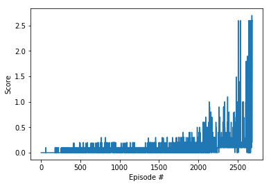

# Report

## Learning Algorithm

The chosen algorithm implemented is Multi-Agent Deep Deterministic Policy Gradient (MADDPG). This algorithm extends the DDPG algorithm for use in Multi-Agent problems. Each agent gets it's own Actor/Critic Networks that it trains.

State Space: 24
Action Space: 2

Actor Architecture (States to Actions):
  1. Linear Layer (33 -> 128, ReLU Activation)
  2. Batch Normalization Layer
  3. Linear Layer (128 -> 128, ReLU Activation)
  4. Linear Layer (128 -> 4, tanh Activation)

Critic Architecture (States & Actions to Reward):
  1. Linear Layer (33 -> 128, ReLU Activation)
  2. Batch Normalization Layer
  3. Linear Layer (128 + 4 -> 128, ReLU Activation)
  4. Linear Layer (128 -> 1)

Hyper-Parameters for the Actor-Critic Algorithm are below:
```python
BUFFER_SIZE = int(1e5)  # replay buffer size
BATCH_SIZE = 128        # minibatch size
GAMMA = 0.99           # discount factor
TAU = 1e-3              # for soft update of target parameters
LR_ACTOR = 1e-4         # learning rate of the actor 
LR_CRITIC = 1e-4        # learning rate of the critic
WEIGHT_DECAY = 0        # L2 weight decay
```

### DDPG Explanation

Actor-Critic methods take advantage of the strengths of both policy-based methods and value-based methods. By combining both kinds of methods, the negatives (for policy-based methods, high variance; for value-based methods, biased results) are reduced, hopefully giving an overall better agent with quicker convergence.

The Actor in DDPG attempts to predict the best action for every given state (a deterministic policy, instead of a stocastic policy from other Actors in Actor-Critic methods). The critic then uses the actors best action, along with the given state, to estimate the total value of that action in that state. This is very similar to the TD update used in DQN (see project 1).

DDPG also takes advantage of a Replay Buffer.

Like DQN, DDPG maintains two copies of the neural network, the "regular" network and the "target" network. DQN runs a bunch of time steps then copies the weights learned in the regular network into the target network all at once. In DDPG, this process is done more gradually in the form of a "Soft-Update". The TAU parameter controls how much the target network is moved towards the regular network at each step.

Small modifications to the DDPG agent found [here](https://github.com/udacity/deep-reinforcement-learning/tree/master/ddpg-pendulum) we made to accomidate running and training 20 agents from the same Actor/Critic networks. Running with the many agents helps improve overall training speed, since more independent experiences will end up in the replay buffer.

## Plot of Rewards



After hitting 249 episodes, the past 100 episodes (averaged over 20 agents) met the +30 score requirement to consider the enviroment solved.

## Ideas for Future Work

In finding the correct hyper-parameters, larger networks were found to do pretty well (before adding in the batch normalization layer into each network). Higher performance is likely to come from combing both, the larger networks and additional batch normalization layers. 

Prioritized Replays (where "boring" experiences are dropped) would also help improve the agent and allow it to train quicker.
